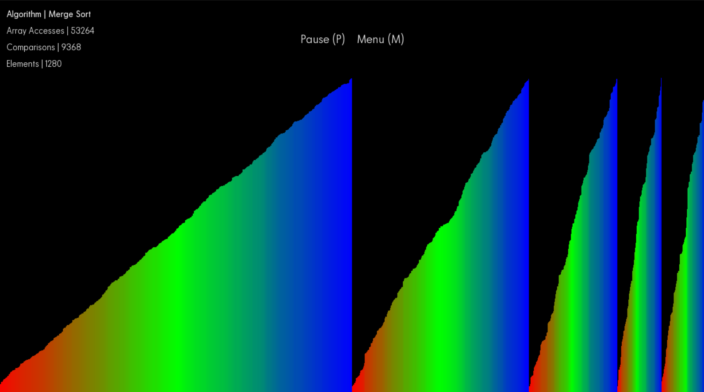

# Sorting-Algorithms-Visualiser ##
Developed with the Python language and its PyGame library to visualise sorting algorithms. It displays a GUI that can be used to configure the visualisation's attributes to display your desired algorithm in your desired fashion. This project was initially developed without the usage of version control.

## Preview ##

## Usage ##
* Install [Python](https://www.python.org/downloads/) and [PyGame](https://www.pygame.org/news)
* Clone this repository
* Keep file/folder names
* Ensure `Code` and `Misc` are in the **same directory**
* Run `visualiserMain.py`

## Contribution ##
* Incorporate new algorithms 
* Suggest processing changes
* Report bugs
